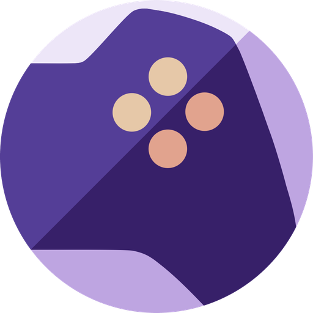

<div align="center">



# RomM for iOS

**Your self-hosted retro library, in your pocket.**

Browse your [RomM](https://github.com/rommapp/romm) collection, play it on iPhone and iPad, and keep your saves in sync with your server.

[](https://testflight.apple.com/join/F4C5mhrC)


[](#getting-started)
[](#getting-started)
[](#getting-started)
[](https://github.com/rommapp/romm)
[](#supported-systems)
[](https://retroachievements.org)
[](LICENSE)
[](https://discord.gg/wCNJVP86VX)

[](https://github.com/ilyas-hallak/romm-ios-app/stargazers)
[](https://github.com/ilyas-hallak/romm-ios-app/commits/main)
[](https://github.com/ilyas-hallak/romm-ios-app/pulse)
[](https://github.com/ilyas-hallak/romm-ios-app/issues)
[](https://github.com/ilyas-hallak/romm-ios-app/graphs/contributors)

<br />


</div>

## Why RomM for iOS

- **Play right in the app.** Native Delta cores and libretro cores run your games on the device, no second emulator needed.
- **Saves follow you.** Save files and save states sync with your RomM server, so you can pick up where you left off on any device.
- **Works offline.** Download games once and play on the train, on a plane, wherever.
- **Built for iOS.** A native SwiftUI app with controller support, external display output and the look and feel of the platform.

## Supported systems

| System | Core |
| --- | --- |
| Game Boy, Game Boy Color | Delta (Gambatte) |
| Game Boy Advance | Delta (VBA-M) |
| NES | Delta (Nestopia) |
| SNES | Delta (Snes9x) |
| Nintendo 64 | Delta (Mupen64Plus) |
| Nintendo DS | Delta (melonDS) |
| PlayStation | libretro (PCSX ReARMed) |
| PlayStation Portable | libretro (PPSSPP) |
| Mega Drive / Genesis, Master System, Game Gear, Sega CD | libretro (Genesis Plus GX) |
| Dreamcast | libretro (Flycast) |
| PC Engine / TurboGrafx-16, SuperGrafx | libretro (Beetle PCE FAST) |

Prefer another emulator?
Games can also be handed off to RetroArch, Delta, Manic EMU or Provenance.

## Features

**Play**
- Physical controllers, with an optional A/B and X/Y swap for Nintendo layouts
- Play on TV with an Apple TV or HDMI adapter, optionally with the phone as a pure controller
- Rumble for PlayStation games, 2x fast-forward in the native engine
- RetroAchievements on the game page, including what you have already unlocked
- BIOS management for the cores that need it

**Library**
- Covers, screenshots and full metadata from your RomM server
- Browse by platform, search the whole library, organise games in collections
- Card and list layouts, dark mode, server statistics
- Quick server setup by scanning a QR code

**Sync and offline**
- Cloud sync for save files and save states, automatic or on demand
- Download ROMs for offline play, with progress and transfer rate
- Transfer ROMs to other devices over SFTP

See the [changelog](CHANGELOG.md) for what landed in each build.

## Getting started

The easiest way is the [TestFlight beta](https://testflight.apple.com/join/F4C5mhrC).
You need a running [RomM](https://github.com/rommapp/romm) server, version 5.0 or newer.

To build it yourself, clone with submodules, the emulator cores live in `Vendor/`:

```sh
git clone --recurse-submodules https://github.com/ilyas-hallak/romm-ios-app.git
```

If you already cloned without them, run `git submodule update --init --recursive`.
Then open `romm/romm.xcodeproj` in Xcode and build.
The Simulator needs nothing else.

Questions, ideas or bugs?
Drop by `#ios-app` on the [RomM Discord](https://discord.gg/wCNJVP86VX) or open an [issue](https://github.com/ilyas-hallak/romm-ios-app/issues).

<details>
<summary><b>Building on a physical device</b></summary>

<br />

To run on a device you need your own Apple Developer team and a bundle identifier that is unique to you.
The upstream `de.ilyashallak.*` identifiers are already registered to the maintainer and cannot be re-registered to your account.

The project reads both values from a gitignored `Signing.xcconfig`, so you never have to edit `project.pbxproj`:

```sh
cp romm/Config/Signing.xcconfig.template romm/Config/Signing.xcconfig
```

Then edit `romm/Config/Signing.xcconfig` and set:

- `DEVELOPMENT_TEAM`, your 10-character Team ID (Xcode > Settings > Accounts, or the Apple Developer site under Membership details)
- `ROMM_BUNDLE_ID_PREFIX`, a reverse-DNS prefix only you use, e.g. `com.yourname`

Signing is automatic, so Xcode registers the App ID and provisioning profile the first time you build to a connected device.

**The emulator core submodules**

`Signing.xcconfig` only applies to this project's targets, not to the DeltaCore projects under `Vendor/`.
Several of those pin their own `DEVELOPMENT_TEAM`, so a device build needs your team applied to them too:

- **Xcode (UI):** in each `Vendor/*/…xcodeproj`, select every target and set your team under Signing & Capabilities.
  These edits stay in the submodule working trees, don't commit them.
- **Command line:** pass `DEVELOPMENT_TEAM` on the `xcodebuild` invocation.
  It applies to every target in the graph, submodules included, so nothing under `Vendor/` needs editing:

  ```sh
  xcodebuild -project romm/romm.xcodeproj -scheme romm \
    -destination 'generic/platform=iOS' \
    -allowProvisioningUpdates \
    DEVELOPMENT_TEAM=YOURTEAMID \
    build
  ```

  `Signing.xcconfig` is still required, it supplies the unique app bundle identifier (`ROMM_BUNDLE_ID_PREFIX`) that no command-line override can set per-target.

</details>

## Contributing

Issues and pull requests are welcome.
A few rules keep the codebase consistent:

1. Follow the Clean Architecture layers (Domain / Data / UI)
2. One ViewModel per View, no sharing between views
3. Use Cases must not call other Use Cases, compose them in the ViewModel
4. Use the existing dependency injection
5. All user-facing strings are in English

## Credits

> *Standing on the shoulders of giants.*

This app would not exist without the open-source emulation work of:

- **[Delta / DeltaCore](https://github.com/rileytestut/DeltaCore)** by [Riley Testut](https://github.com/rileytestut), the framework behind GB, GBC, GBA, NES, SNES, N64 and NDS
- **[libretro](https://www.libretro.com)** and the authors of PCSX ReARMed, PPSSPP, Genesis Plus GX, Flycast and Beetle PCE FAST
- **[RomM](https://github.com/rommapp/romm)**, the self-hosted ROM manager this app is built for

## License

MIT, see [LICENSE](LICENSE).
This is an independent client and part of the RomM ecosystem.
